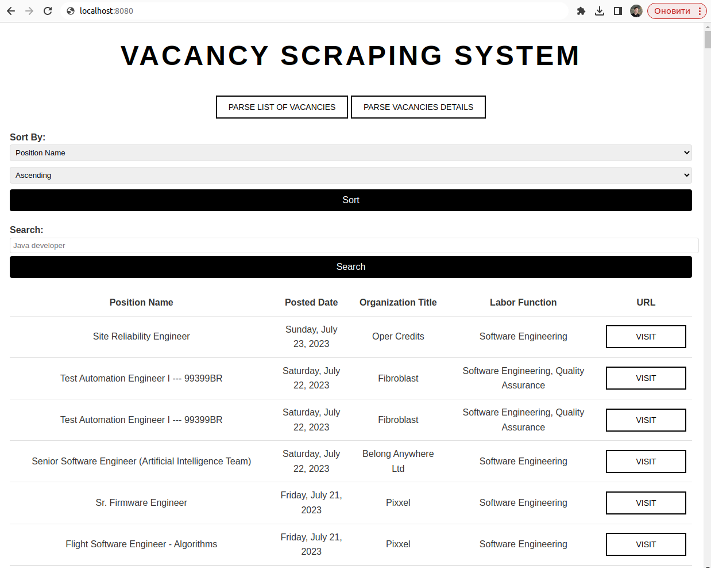

# Vacancy Parser Application
##### This application allows you to parse job vacancies from Techstars Jobs website. It utilizes Selenium WebDriver to automate the process of extracting job listings and their details based on a specific job function set in the code.

### How to Use the Application
### 1. Start the Application: Launch the application and ensure that all necessary dependencies are installed.

### 2. Parse List of Vacancies:
Click on the "Parse list of vacancies" button to initiate the parsing process.
The application will use Selenium to navigate to Techstars Jobs website and collect the list of vacancies related to the specified job function.
Allow the application some time to complete the parsing of all relevant vacancies from the Techstars Jobs website.
Parse Vacancies Details:

### 3. Once the list of vacancies has been obtained, click on the "Parse vacancies details" button to retrieve comprehensive information about each job listing.
The details gathered for each vacancy include:
 Job Page URL on Techstars Jobs website.
* Position Name.
* URL to Organization's website.
* Organization Logo (stored as a link to the image).
* Organization Title.
* Labor Function.
* Location (parsed and saved as separate parts if possible, multiple locations can be provided).
* Posted Date (saved in Unix Timestamp format).
* Description (saved with HTML formatting).
* Tags Names (can be multiple).
* Filtering and Searching Vacancies
* After parsing the vacancies and collecting their details, you can use the built-in filter and search functionality to find the specific vacancy you are interested in. The application provides an efficient way to navigate through the database of parsed vacancies and access the information that suits your requirements.

### 4. Explore the Vacancies using Search Fields and Filters

